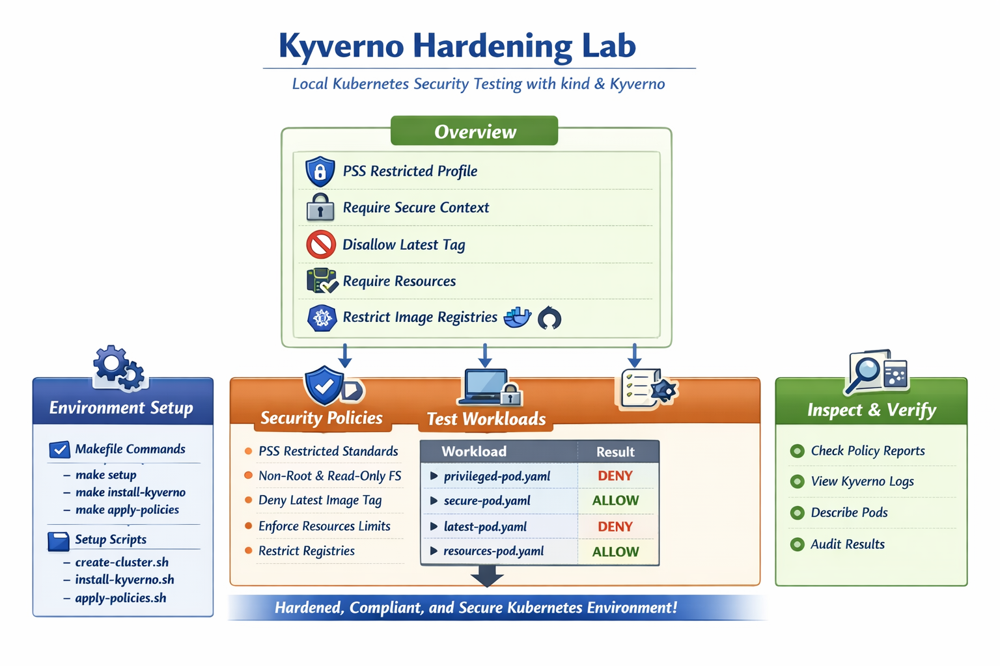

# Kyverno Hardening Lab

A local Kubernetes security-hardening lab using **kind** and **Kyverno** to demonstrate pod security policy enforcement.

## Overview



This lab sets up a single-node kind cluster with Kyverno policy engine to test various security policies:

- **PSS Restricted Profile** - Pod Security Standards restricted policies
- **Require Secure Context** - Enforce non-root user and read-only root filesystem
- **Disallow Latest Tag** - Block container images using `:latest` tag
- **Require Resources** - Enforce CPU/memory requests and limits
- **Restrict Image Registries** - Allow only docker.io and ghcr.io registries

## Prerequisites

- [kind](https://kind.sigs.k8s.io/) (Kubernetes in Docker)
- [kubectl](https://kubernetes.io/docs/tasks/tools/)
- [helm](https://helm.sh/)
- Docker runtime

## Quick Start

### Option 1: Use Makefile

```bash
# Full setup (create cluster + install Kyverno + apply policies)
make setup

# Or run steps individually
make create-cluster
make install-kyverno
make apply-policies

# Run tests
make test

# Cleanup
make clean
```

### Option 2: Use Scripts

```bash
# Create cluster
cd kyverno-lab
./scripts/create-cluster.sh

# Install Kyverno
./scripts/install-kyverno.sh

# Apply policies
./scripts/apply-policies.sh

# Run tests
./scripts/test-all.sh

# Cleanup
./scripts/delete-cluster.sh
```

## How to Inspect Results

### Check Kyverno Policies

```bash
kubectl get clusterpolicy
kubectl describe clusterpolicy <policy-name>
```

### Check Policy Reports

```bash
kubectl get policyreport -A
```

### Check Pods

```bash
kubectl get pods -A
kubectl describe pod <pod-name>
```

### View Kyverno Logs

```bash
kubectl logs -n kyverno -l app.kubernetes.io/name=kyverno
```

## Test Workloads

The lab includes 8 test workloads in `workloads/`:

| Workload | Expected | Reason |
|----------|----------|--------|
| `privileged-pod.yaml` | DENY | Privileged container |
| `insecure-pod.yaml` | DENY | Root user, non-readonly fs |
| `secure-pod.yaml` | ALLOW | Compliant security context |
| `latest-pod.yaml` | DENY | Uses `:latest` tag |
| `versioned-pod.yaml` | ALLOW | Explicit version tag |
| `no-resources-pod.yaml` | DENY | No resources defined |
| `resources-pod.yaml` | ALLOW | Has requests/limits |
| `bad-registry-pod.yaml` | DENY | Uses gcr.io |

## Cleanup

```bash
# Delete cluster
make clean

# Or using scripts
kind delete cluster --name kyverno-lab
```

## Project Structure

```
kyverno-lab/
├── kind-cluster.yaml      # Kind cluster configuration
├── scripts/
│   ├── create-cluster.sh
│   ├── delete-cluster.sh
│   ├── install-kyverno.sh
│   ├── apply-policies.sh
│   └── test-all.sh
├── policies/
│   ├── pss-restricted.yaml
│   ├── cpol-require-secure-context.yaml
│   ├── cpol-disallow-latest.yaml
│   ├── cpol-require-resources.yaml
│   └── cpol-restrict-image-registries.yaml
└── workloads/
    ├── privileged-pod.yaml
    ├── insecure-pod.yaml
    ├── secure-pod.yaml
    ├── latest-pod.yaml
    ├── versioned-pod.yaml
    ├── no-resources-pod.yaml
    ├── resources-pod.yaml
    └── bad-registry-pod.yaml
```

---

Built with [Kyverno](https://kyverno.io/) policy engine.